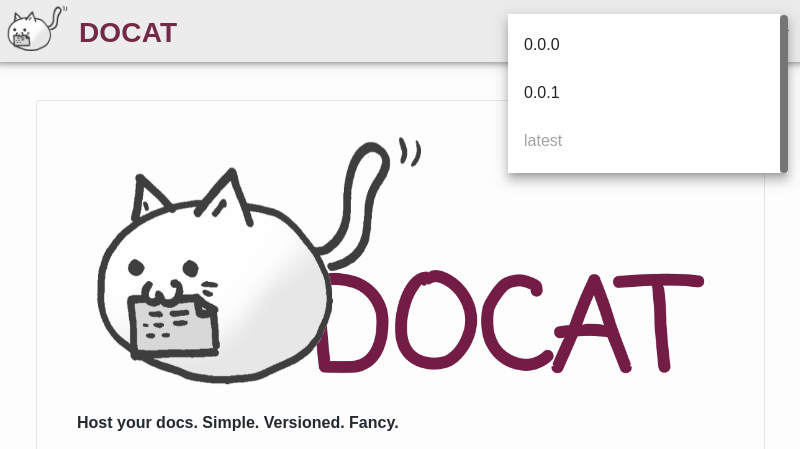

**Host your docs. Simple. Versioned. Fancy.**

## Getting started

The simplest way is to build and run the docker container,
you can optionally use volumes to save state:

```sh
# run container in background and persist data (docs, nginx configs)
# use 'randombenj/docat:unstable' to get the latest changes
docker run \
  --detach \
  --volume /path/to/doc:/var/docat/doc/ \
  --volume /path/to/locations:/etc/nginx/locations.d/ \
  --publish 8000:80 \
  randombenj/docat
```

Go to [localhost:8000](http://localhost:8000) to view your docat instance:



If you want to run the application different than in a docker container, look at the
[backend](backend/README.md) and [web](web/README.md) docs.

### Push documentation to docat

If you have static html documentation or use something like
[mkdocs](https://www.mkdocs.org/), [sphinx](http://www.sphinx-doc.org/en/master/), ...
to generate your documentation, you can push it to docat:

```sh
# create a zip of your docs
zip -r docs.zip /path/to/your-docs
# upload them to the docat server (replace PROJECT/VERSION with your projectname and the version of the docs)
curl -X POST -F "file=@docs.zip" http://localhost:8000/api/PROJECT/VERSION
```

When you have multiple versions you may want to tag some version as **latest**:

```sh
# tag the version VERSION of project PROJECT as latest
curl -X PUT http://localhost:8000/api/PROJECT/VERSION/tags/latest
```
